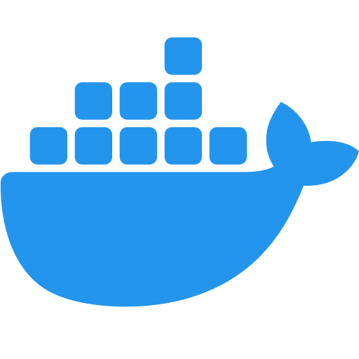

# HomeLab - 🖥️  Meu servidor em Casa 🏠

#### Este repositório descreve meu estudos, quanto a arquitetura técnica e a configuração de um Home Lab baseado em Linux, containers e tunelamento seguro com Cloudflare.

## Infra
Estou utilizando o Ubuntu Server como sistema operacional em minha máquina, por conta da familiaridade que tenho com a distro, e o grande suporte que a Canonical e Comunidade entregam.

Para monitorar memória, disco e rede, uso o *bpytop* no proprío terminal.

## Docker 
Para monitorar *containers docker*, estou usando o **Portainer** na web, na porta 9090. Sendo possível acessar na rede local com o *localhost:9090 ou ip-local:9090* & na Internet, pelo subdomínio **portainer.lucaspanzera.com**, configurado e monitorado com a ajuda da *CloudFlare Tunnel*.

## Postgres & Pgadmin
Gosto bastante de usar postgreSQL em meus projetos, e para roda-ló em meu homelab, subi via *Containers Docker*, o Postgres e o Pgadmin (Interface web de gerenciamento de postgreSQL).

O arquivo para subir esses servicos, estao disponíveis em -> <a href="docs/dockersfiles/postgres-pgadmin.yml">postgres-pgadmin.yml</a>

**Lembre-se de alterar o nome do arquivo para docker-compose.yml, e também, definir as credenciais no arquivo.*

**Rodando na Net / Com ajuda da CloudFlare Tunnel*

## Ambiente de testes
Estou usando o HomeLab, como uma VPS de testes.

Apredendo um pouco mais sobre CI e CD, variáveis de ambiente, perfomace de aplicacoes e etc.

Já preparo imagens *Docker* de aplicacoes minhas em Node, subo & monitoro.

**Subindo uma aplicacao com Docker*

**Rodando na Net / Com ajuda da CloudFlare Tunnel*
