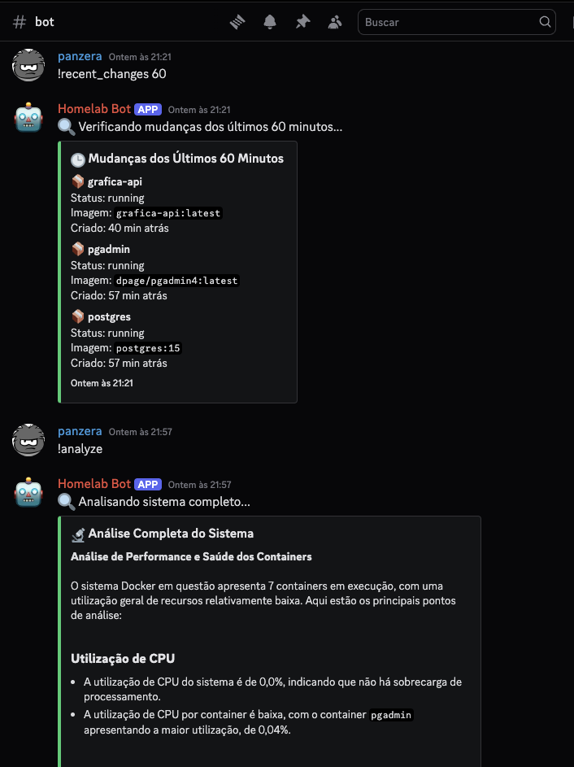

# 🏠 HomeLab | VPS at Home

<div align="left">

[](https://ubuntu.com/)
[](https://docker.com/)
[](https://cloudflare.com/)

*🖥️ Meu laboratório de estudos e desenvolvimento em casa | Aprendendo infraestrutura de produção*

</div>

- [🏗️ Infra](#️-infra) • [🐳 Docker](#-docker) • [🐘 Postgresql](#-postgres--pgadmin) • [🧪 Ambiente de testes](#-ambiente-de-testes) • [🗂️ CI&CD](#️-cicd) • [🤖 Discord Bot](#️-bot) •

---

#### Este repositório descreve meu estudos, quanto a arquitetura técnica e a configuração de um Home Lab baseado em Linux, containers e tunelamento seguro com Cloudflare.

## 🏗️ Infra

Estou utilizando o Ubuntu Server como sistema operacional em minha máquina, por conta da familiaridade que tenho com a distro, e o grande suporte que a Canonical e Comunidade entregam.

Para monitorar memória, disco e rede, uso o *bpytop* no próprio terminal.


## 🐳 Docker

Para monitorar *containers docker*, estou usando o **Portainer** na web, na porta 9090. Sendo possível acessar na rede local com o *localhost:9090 ou ip-local:9090* & na Internet, pelo subdomínio **portainer.lucaspanzera.com**, configurado e monitorado com a ajuda da *CloudFlare Tunnel*.


## 🐘 Postgres & Pgadmin

Gosto bastante de usar postgreSQL em meus projetos, e para rodá-lo em meu homelab, subi via *Containers Docker*, o Postgres e o Pgadmin (Interface web de gerenciamento de postgreSQL).

O arquivo para subir esses serviços, estão disponíveis em → <a href="docs/dockersfiles/postgres-pgadmin.yml">postgres-pgadmin.yml</a>

**Lembre-se de alterar o nome do arquivo para docker-compose.yml, e também, definir as credenciais no arquivo.*


*Rodando na Net / Com ajuda da CloudFlare Tunnel*

## 🧪 Ambiente de testes

Estou usando o HomeLab, como uma VPS de testes.

Aprendendo um pouco mais sobre CI e CD, variáveis de ambiente, performance de aplicações e etc.

Já preparo imagens *Docker* de aplicações minhas em Node, subo & monitoro.

**Subindo uma aplicação com Docker**


**Rodando na Net / Com ajuda da CloudFlare Tunnel**


## 🗂️ CI/CD

Recentemente implementei um pipeline de CI/CD para automatizar o deploy da minha API Node.js que roda no meu homelab

### Meu setup inicial

- **Projeto**: Monorepo Node.js com Turbo
- **Backend**: Express + JWT + PostgreSQL rodando em Docker
- **Gerenciamento**: pnpm para dependências

O desafio era automatizar deploys quando eu fizesse push na branch main, mas sem expor minha VPS diretamente na internet.

### Configuração do SSH via Cloudflare Tunnel

Primeiro precisei configurar acesso SSH através do Cloudflare Tunnel. No arquivo de configuração do tunnel (`config.yml`), adicionei:

```yaml
# Nova regra para SSH
- hostname: ssh.meudominio.com
  service: ssh://localhost:22
```

### Configuração do GitHub Actions

Criei o workflow em `.github/workflows/deploy.yml`:

```yaml
name: Deploy API via Cloudflare Tunnel

on:
  push:
    branches: [main]
    paths:
      - 'apps/api/**'
  workflow_dispatch:

jobs:
  deploy:
    runs-on: ubuntu-latest
    
    steps:
      - name: Checkout code
        uses: actions/checkout@v4
        
      - name: Setup Cloudflared SSH Client
        uses: tichopad/setup-cloudflared-ssh-client@v1
        
      - name: Setup SSH Key
        run: |
          mkdir -p ~/.ssh
          echo "${{ secrets.SSH_PRIVATE_KEY }}" > ~/.ssh/id_rsa
          chmod 600 ~/.ssh/id_rsa
          
      - name: Configure SSH Client
        run: |
          cat >> ~/.ssh/config << 'EOF'
          Host homelab
            HostName ${{ secrets.SSH_HOST }}
            User ${{ secrets.SSH_USER }}
            ProxyCommand cloudflared access ssh --hostname %h
            IdentityFile ~/.ssh/id_rsa
            StrictHostKeyChecking no
          EOF
          
      - name: Deploy to Homelab
        run: |
          ssh homelab << 'EOF'
            cd /home/panzera/Github/grafica
            git pull origin main
            
            # Garantir que pnpm está no PATH
            export PATH="/home/panzera/.local/share/pnpm:$PATH"
            
            pnpm install --frozen-lockfile
            pnpm turbo build --filter=grafica-api
            docker-compose down api
            docker-compose up -d --build api
            
            # Health check
            sleep 10
            if curl -f http://localhost:3000/health; then
              echo "✅ Deploy successful!"
            else
              echo "❌ Health check failed"
              exit 1
            fi
          EOF
```

### Configuração dos Secrets

No GitHub, em **Settings → Secrets and variables → Actions**, configurei:

- `SSH_HOST`: `ssh.meudominio.com`
- `SSH_USER`: `panzera`
- `SSH_PRIVATE_KEY`: Conteúdo completo da minha chave privada SSH

### Resultado

Agora, sempre que faço push na main com mudanças na pasta `apps/api/**`, o workflow:

1. ✅ Conecta na minha VPS via Cloudflare Tunnel
2. ✅ Faz pull das mudanças
3. ✅ Instala dependências com pnpm
4. ✅ Executa build com Turbo
5. ✅ Reconstrói e sobe o container Docker
6. ✅ Faz health check da API

Todo o processo leva cerca de 2-3 minutos, e posso acompanhar em tempo real na aba Actions do GitHub.


## 🤖 Bot de Monitoramente no Discord
Usando Python, estou desenvolvendo um bot Discord inteligente para monitorar e gerenciar containers Docker do seu homelab com IA integrada, monitoramento avançado de recursos e notificações automáticas de deploy! Voce pode acompanhar mais em <a href="https://github.com/lucaspanzera1/discordbot-homelab">Discord Bot Homelab</a>

